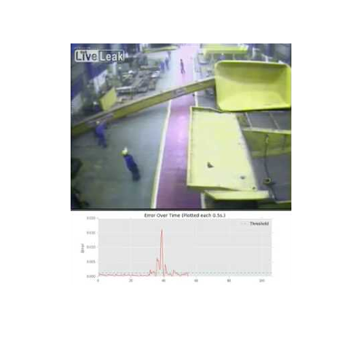
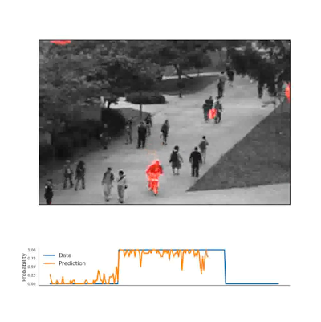

# Video Anomaly Detection - with Azure ML and MLOps

[](https://dev.azure.com/aidemos/MLOps/_build/latest?definitionId=88?branchName=master)

The automation of detecting anomalous event sequences in videos is a challenging problem, but also has broad applications across industry verticals.  

The approach followed in this repository involves self-supervised training deep neural networks to develop an in-depth understanding of the physical and causal rules in the observed scenes. The model effectively learns to predict future frames in the video in a self-supervised fashion. 

The trained model can then be used to detect anomalies in videos. As the model tries to predict each next frame, one can calculate the error in the model's prediction. If the error is large, it is likely that an anomalous even occurred.

The approach can be used both in a supervised and unsupervised fashion, thus enabling the detection of pre-defined anomalies, but also of anomalous events that have never occurred in the past. 

> Post on [LinkedIn](https://www.linkedin.com/feed/update/urn:li:activity:6512538611181846528) (includes **video**)

Here is a demonstration of this approach in an unsupervised fashion:
[](https://www.youtube.com/watch?v=a966CT7PtHg)

Here is a demonstration of this approach in a supervised fashion:
[](https://coursematerial.blob.core.windows.net/assets/video_anomaly_detection.mp4)

# Learning Goals

You will learn:
1. How to adapt an existing neural network architecture to your use-case.
1. How to prepare video data for deep learning. 
1. How to perform hyperparameter tuning with [HyperDrive](https://azure.microsoft.com/en-us/blog/experimentation-using-azure-machine-learning/) to improve the performance of your model.
1. How to deploy a deep neural network as a webservice for video processing. 
1. How to post-process the output of a Keras model for secondary tasks (here, anomaly detection).
2. How to define a build pipeline for DevOps.


# Pre-requisites

## Skills

1. Some familiarity with concepts and frameworks for neural networks:
	- Framework: [Keras](https://keras.io/) and [Tensorflow](https://www.tensorflow.org/)
	- Concepts: [convolutional](https://keras.io/layers/convolutional/), [recurrent](https://keras.io/layers/recurrent/), and [pooling](https://keras.io/layers/pooling/) layers.
2. Knowledge of basic data science and machine learning concepts. [Here](https://www.youtube.com/watch?v=gNV9EqwXCpw) and [here](https://www.youtube.com/watch?v=GBDSBInvz08) you'll find short introductory material.
3. Moderate skills in coding with Python and machine learning using Python. A good place to start is [here](https://www.youtube.com/watch?v=-Rf4fZDQ0yw&list=PLjgj6kdf_snaw8QnlhK5f3DzFDFKDU5f4).

## Software Dependencies

- Various python modules. We recommend working with a conda environement (see `config/environment.yml` and [Documentation](https://conda.io/projects/conda/en/latest/user-guide/tasks/manage-environments.html)).  We recommend you begin by installing [Miniconda](https://docs.conda.io/en/latest/miniconda.html).
- If you are using a [DSVM](https://azure.microsoft.com/en-us/services/virtual-machines/data-science-virtual-machines/):
	- We recommend VS code [https://code.visualstudio.com/](https://code.visualstudio.com/) with [ssh - remote](https://code.visualstudio.com/docs/remote/ssh) extension.
	- We recommend X2Go [https://wiki.x2go.org/doku.php](https://wiki.x2go.org/doku.php)


## Hardware Dependencies

A computer with a GPU, for example a Linux Azure VM.  Compare VM [sizes](https://docs.microsoft.com/en-us/azure/virtual-machines/sizes-gpu) and [prices](https://azure.microsoft.com/en-us/pricing/details/virtual-machines/linux/)).  If you don't know what to choose, we recommend the Standard NC6, the most affordable VM with a GPU.

You could create a VM in the [Azure Portal](https://ms.portal.azure.com/#create/microsoft-dsvm.ubuntu-18041804).

## Dataset

[UCSD Anomaly Detection Dataset](http://www.svcl.ucsd.edu/projects/anomaly/dataset.htm)

## Agenda

The recommended first step is to clone this repository.

### Getting Started

1. [Data Preparation](./docs/data_prep_w_pillow.md) - Download and prepare data for training/testing.
1. [Azure ML Configuration](./docs/aml_configuration.md) - Configure your Azure ML workspace.
1. [AML Pipelines](./docs/aml_pipelines.md) - Automate data preparation, training, and re-training.
1. [Deployment](./docs/deployment.md)
1. [MLOps](./docs/mlops.md) - How to quickly scale your solution with the MLOps extension for DevOps.

### Deep-dive

1. [Model Development](./docs/model_development.md) - Understand model architecture and training.
1. [Fine Tuning](./docs/fine_tuning.md) - Perform transfer learning with pretrained model onnew data.
1. [Hyperparameter tuning](./docs/hyperparameter_tuning.md) - Tune hyperparameters with HyperDrive.
1. [Anomaly Detection](./docs/anomaly_detection.md) - Use Model errors for detecting anomalies.

## Contribute

We invite contributions to this repository. The preferred method would be to fork this repository and to create a pull request.

## References / Resources

- Research Article: [Deep predictive coding networks for video prediction and unsupervised learning](https://arxiv.org/abs/1605.08104) by Lotter, W., Kreiman, G. and Cox, D., 2016.

	```
	@article{lotter2016deep,
	title={Deep predictive coding networks for video prediction and unsupervised learning},
	author={Lotter, William and Kreiman, Gabriel and Cox, David},
	journal={arXiv preprint arXiv:1605.08104},
	year={2016}
	}
	```
- Original Prednet implementation is on [github.com](https://coxlab.github.io/prednet/).

- Interesting blog post on [Self-Supervised Video Anomaly Detection](https://launchpad.ai/blog/video-anomaly-detection) by [Steve Shimozaki](https://launchpad.ai/blog?author=590f381c3e00bed4273e304b) 
